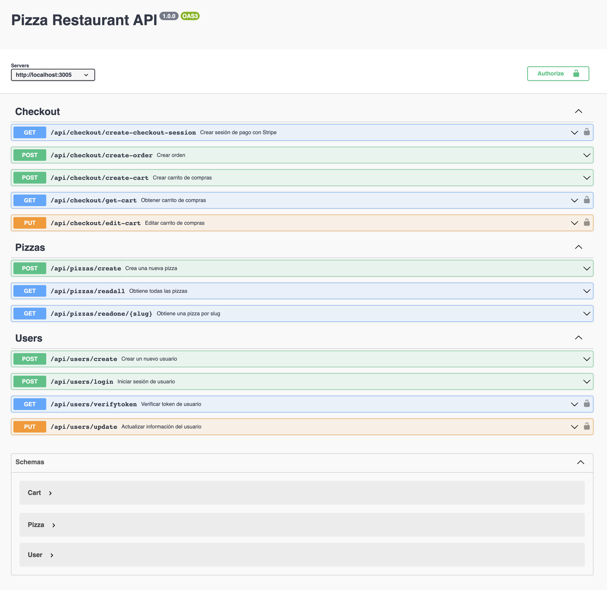

# PROYECTO 6: Aplicación Backend con Autenticación

## **ÍNDICE**

* [1. Intro](#1-intro)
* [2. Demo](#2-demo)
* [3. ¿Qué construirás?](#3-qu%C3%A9-construir%C3%A1s)
* [4. Objetivos de Aprendizaje](#4-objetivos-de-aprendizaje)
* [5. Requisitos](#5-requisitos-y-entregables)
* [6. Criterios de evaluación](#6-criterios-de-evaluaci%C3%B3n)
* [7. Entregas](#7-entregas)

****

## 1. Intro

En este proyecto, tu objetivo será construir una aplicación backend que administre la autenticación y autorización de los usuarios. Este es un componente fundamental en la mayoría de las aplicaciones web, y este proyecto te dará la oportunidad de aprender sobre las mejores prácticas y las herramientas disponibles para manejar estas tareas, como los `JWT` (`JSON Web Tokens`).

Además, utilizarás `MongoDB` y `Mongoose` para la persistencia de datos, y construirás un modelo de usuario y un modelo de "producto" que puede ser cualquier elemento que desees enlazar con el usuario (como compras, artículos creados por el usuario, listas de tareas, etc.). Estos modelos estarán relacionados entre sí a través de `MongoDB`.

También utilizarás `OpenAPI` y `Swagger` para documentar tu aplicación, y tu código deberá seguir una estructura de carpetas clara con controladores, modelos y rutas. Finalmente, desplegarás tu aplicación a través de render.com y `MongoDB Atlas`.

****

## 2. Demo

Visita la demostración aquí: [LINK](https://github.com/UDDBootcamp/7M_FULLSTACK_M6_PROY/tree/master/demo)

En esta demo, se muestra una aplicación de autenticación de usuarios, manejo de carrito de compras y gestión de productos. Usamos 3 modelos. 

Se implica un proceso de comercio electrónico a través de la pasarela de pagos `Stripe`.

La documentación de la API en esta demo utiliza `Swagger` y `OpenAPI`. 

Te recomendamos revisar todo la demo cuidadosamente antes de iniciar este proyecto, para asegurarte de que comprendes todos los requisitos y puedas realizar una aplicación similar.

La documentación y el proceso de comercio electrónico es opcional en este proyecto. Cuando realices el propio, puedes concentrarte únicamente en tus modelos de autenticación y producto, sin embargo, te alentamos a explorar el modelo de compras.




****

## 3. ¿Qué construirás?

Construirás una aplicación `backend` que maneja la autenticación y autorización de usuarios. La aplicación debe incluir un modelo de usuario y un modelo de `Producto` que puede ser cualquier elemento que desees enlazar con el usuario. 

Los modelos deben estar relacionados entre sí a través de `MongoDB` y la aplicación debe permitir las operaciones `CRUD` en los "productos".

A continuación, te presentamos una posible estructura de carpetas para tu aplicación:

```
EJEMPLO_TU_PROYECTO
├─ .env
├─ .gitignore
├─ README.md
├─ controllers
│  ├─ userController.js
│  └─ productController.js
├─ models
│  ├─ userModel.js
│  └─ productModel.js
├─ routes
│  ├─ userRoutes.js
│  └─ productRoutes.js
└─ server.js  <- TU ARCHIVO DE ENTRADA
```

En este proyecto, te enfrentarás a dos tareas principales:

- Crearás una aplicación backend con funciones de autenticación y autorización utilizando tecnologías como `JWT` (`JSON Web Tokens`). Esta aplicación te permitirá entender y experimentar la importancia de la seguridad en las aplicaciones web, así como también la manera en la que diferentes herramientas pueden ser utilizadas para implementar mecanismos de autenticación en los servidores.

- La aplicación deberá estar estructurada de tal manera que incluya dos modelos principales, uno para el `Usuario` y otro para cualquier `Producto` o elemento que desees enlazar a ese usuario. Estos productos pueden ser cualquier cosa, desde compras y artículos creados por el usuario hasta listas de tareas pendientes. La intención de esta estructura es que ambos modelos estén interrelacionados a través de `MongoDB`, la base de datos que has estado aprendiendo en las últimas semanas. Usarás `Mongoose` como ORM para facilitar esta interacción.

Además de lo anterior, estarás utilizando `OPENAPI` y `Swagger` para el proceso de documentación, de manera opcional. 

Finalmente, la entrega del proyecto se realizará a través de render.com, enfocándonos únicamente en el servicio web. Para el despliegue de la base de datos, usarás `MongoDB Atlas`.

Para el modelo del `producto` o elemento, deberás implementar el proceso de `CRUD` (Crear, Leer, Actualizar, Borrar) al desarrollar los servicios. Para esto, usarás express.js y cors, y deberás estructurar tus carpetas con controladores, modelos y rutas. También aplicarás dotenv para el manejo de las variables de entorno.

En caso de que lo necesites, puedes crear otro modelo adicional.

A continuación, se te compartirá los siguientes `endpoints`.

### Endpoints para Usuario:

|Descripción del Endpoint|	Método|	Endpoint|	Ejemplo. Caso de uso.|
|---|----|----|---|
|Registrar un usuario|	POST|	/api/user/register|	Como usuario, quiero registrarme en la plataforma proporcionando mi nombre, correo electrónico y una contraseña.|
|Iniciar sesión de usuario|	POST|	/api/user/login|	Como usuario, quiero iniciar sesión en la plataforma utilizando mi correo electrónico y contraseña para acceder a mis productos.|
|Verificar el token del usuario|	GET|	/api/user/verifytoken|	Como usuario, quiero que mi sesión se mantenga abierta y que la plataforma recuerde mi estado de inicio de sesión.|
|Actualizar información del usuario|	PUT|	/api/user/update|	Como usuario, quiero actualizar mi información de perfil, como mi nombre, correo electrónico y contraseña.|

### Endpoints para Producto:

|Descripción del Endpoint|	Método|	Endpoint|	Ejemplo. Caso de uso.|
|---|----|----|---|
|Crear un producto|	POST|	/api/product/create|	Como vendedor, quiero agregar un nuevo producto a mi catálogo proporcionando detalles como el nombre del producto, descripción y precio.|
|Leer todos los productos|	GET|	/api/product/readall|	Como comprador, quiero ver todos los productos disponibles en el catálogo para poder seleccionar uno para comprar.|
|Leer un producto específico|	GET|	/api/product/readone/:id|	Como comprador, quiero ver los detalles de un producto específico utilizando su ID para decidir si quiero comprarlo.|
|Actualizar un producto|	PUT|	/api/product/update/:id|	Como vendedor, quiero actualizar los detalles de un producto específico, como su nombre, descripción y precio.|
|Eliminar un producto|	DELETE|	/api/product/delete/:id	| Como vendedor, quiero eliminar un producto específico de mi catálogo cuando ya no esté disponible para la venta.|


****

## 4. Objetivos de aprendizaje

Los objetivos principales de este proyecto son:

- Comprender y aplicar conceptos de autenticación y autorización en una aplicación backend.
- Practicar y afianzar tu conocimiento en `MongoDB` y `Mongoose`.
- Aplicar las operaciones `CRUD` en la creación de servicios.
- Entender y utilizar `OPENAPI` y `Swagger` para documentar tus servicios.
- Desarrollar una aplicación completa utilizando `Node.js`, y complementarla con herramientas como `express.js`, `cors` y `dotenv`.
- Utilizar `MongoDB Atlas` para el despliegue de la base de datos y render.com para la entrega del proyecto.


****

## 5. Requisitos y entregables

Usa esta lista para saber los requisitos mínimos del proyecto:

### GENERAL
- [ ] Realizarse de manera individual

### ARQUITECTURA DE CARPETAS

- [ ] Crear una arquitectura de carpetas y archivos, clara
 
### APLICACIÓN DE SERVICIOS CRUD

- [ ] Implementar autenticación y autorización en tu aplicación.
- [ ] Crear dos modelos, uno para el Usuario y otro para el Producto.
- [ ] Implementar operaciones CRUD para el modelo del Producto.
- [ ] Utilizar MongoDB y Mongoose para gestionar la base de datos.

### CONTROL DE VERSIONES
- [ ] Crear un repositorio en GitHub y subir el proyecto al mismo.


### ENTREGA A TIEMPO
- [ ] Entregar a tiempo el proyecto.


### DOCUMENTACIÓN DE LA API (OPCIONAL)

- [ ] Documentar todos los `endpoints` utilizando `Swagger` y `OpenAPI`


### DESPLIEGUE (OPCIONAL)
- [ ] Crear una URL de producción para este proyecto, a través de [render.com](https://render.com)

****

## 6. Criterios de evaluación

Tu calificación estará definida en base a los siguientes criterios:


| ÁREA       | % DEL TOTAL |
| ------------- |:-------------:|
|Arquitectura de carpetas y organización de código|30%
|Implementación de autenticación y autorización	|20%
|Implementación de modelado de producto	|20%
|Uso adecuado del control de versiones (Git & GitHub)| 20%
|Entrega a tiempo| 10%


****

## 7. Entregas

- **Definición de fechas.** Habla con tus coaches sobre el periodo de entregas del proyecto. Es importante que te organices y hagas un seguimiento constante de tus avances para cumplir con los plazos establecidos.

- **Cumple con los requisitos y entregables.** En caso de que no logres cumplir con todos los requisitos, se te asignará un progreso proporcional a lo que lograste. Recuerda que lo importante es entregar siempre tu proyecto, independientemente del grado de completitud.

- **Repositorio en GitHub.** Al finalizar tu proyecto, debes subirlo a un repositorio en GitHub. Asegúrate de incluir un archivo `README` con una descripción de tu proyecto, las tecnologías utilizadas y cualquier otra información que consideres relevante.
